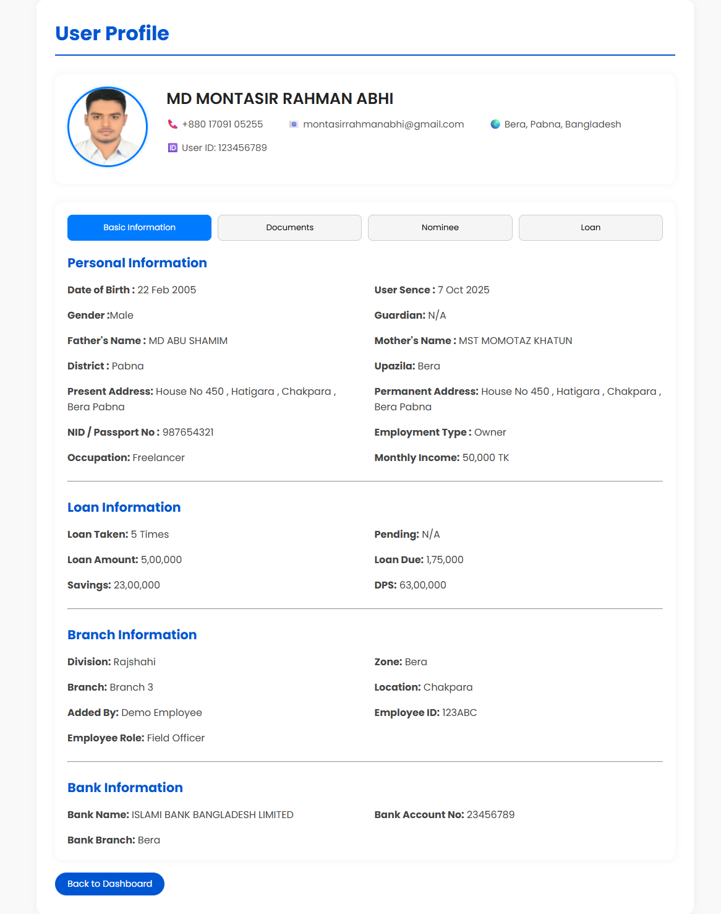
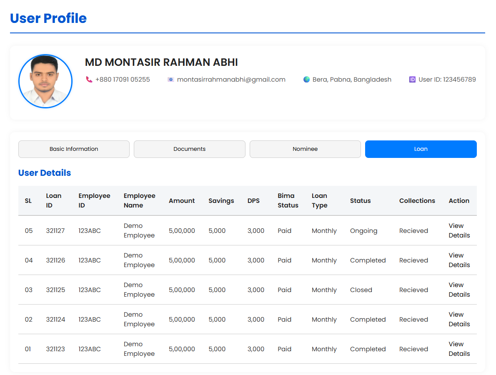

# Loan Management System – View User Section

This is the **View User Section** of the **Loan Management System**, where admins or employees can view detailed information about users, including personal info, loan data, nominee details, and uploaded documents. The design is **clean, modern, and fully responsive**.

---

## 🚀 Features

- **Profile Card:**  
  - Displays user's photo, name, phone, email, location, and user ID.
  - Contact info and location are displayed in **one line** for readability.

- **Tabbed Navigation:**  
  - **Basic Information** – Personal, Loan, Branch, and Bank info  
  - **Documents** – User documents (NID front/back, signature)  
  - **Nominee** – Nominee details and documents  
  - **Loan** – Detailed loan history in a responsive table  

- **Responsive Design:**  
  Fully responsive for desktop, tablet, and mobile devices.

- **Interactive Tabs:**  
  Toggle between different sections **without page reload**.

- **Document Preview & Download:**  
  Click on images to preview in full size and download if needed.

- **Loan Table:**  
  Clean, scrollable table for loan history with all relevant details.

---

## 🛠 Technologies Used

- **HTML5**
- **CSS3** (Poppins font, Flexbox & Grid)
- **Vanilla JavaScript** (for tab switching)

---

## 📁 File Structure

loan-management-system/
│
├── index.html # Main HTML file for View User section
├── css/
│ ├── style.css # Profile and Tabs styles
│ ├── style2.css # Info card & table styles
│ └── table.css # Loan table styles
├── images/
│ ├── profile.png # User profile photo
│ ├── nid_font.png # NID front scan
│ ├── nid_back.png # NID back scan
│ ├── sign.png # Signature
│ └── nominee.png # Nominee photo
└── README.md

---

## 💻 Usage Instructions

1. Clone or download this repository.
2. Place user-related images/documents inside the `images` folder.
3. Open `index.html` in a web browser to view the **User Details** section.
4. Click on the tabs to navigate between:
   - Basic Information
   - Documents
   - Nominee
   - Loan

---

## 🎨 Screenshots

**Profile & Tabs Section**  

**Loan Table Example**  

**Document Preview**  

---

## 📌 Notes

- **Font:** Poppins (from Google Fonts)  
- **Tabs:** Equal width for consistency  
- **Responsive:** Works on all screen sizes  
- This section is part of **Loan Management System** under **View User** functionality.

---

## 🖊 Author

**MD Montasir Rahman Abhi**  
- Email: montasirrahmanabhi@gmail.com  
- Phone: +8801709105255  
- Portfolio: <a herf="https://www.montasirabhi.com/">Click Here</a>

---

## 📄 License

This project is licensed under the MIT License.  
